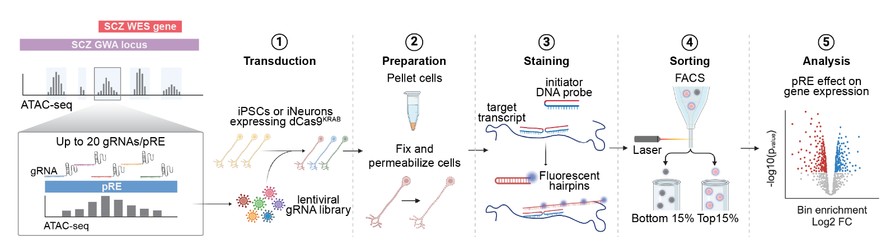
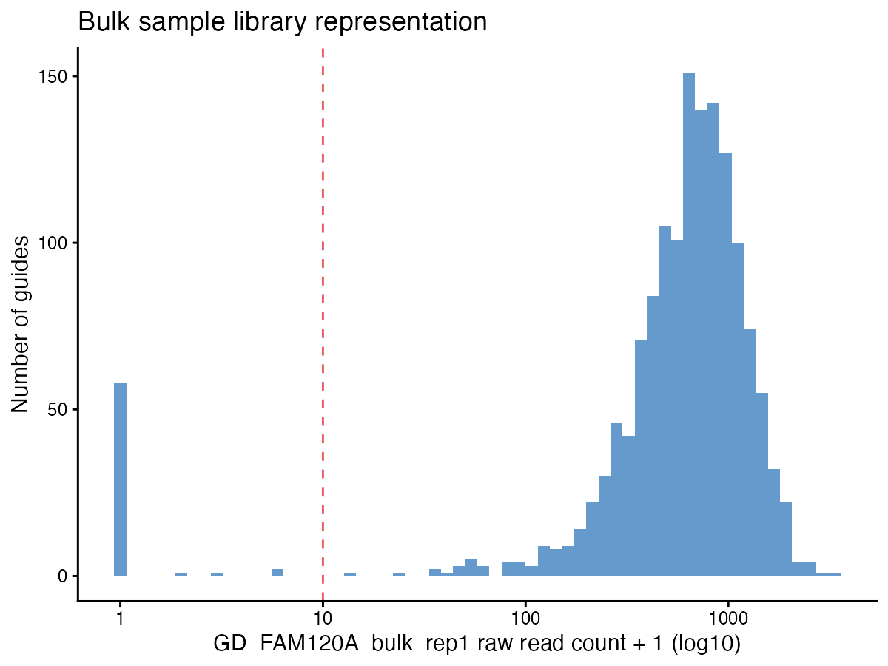
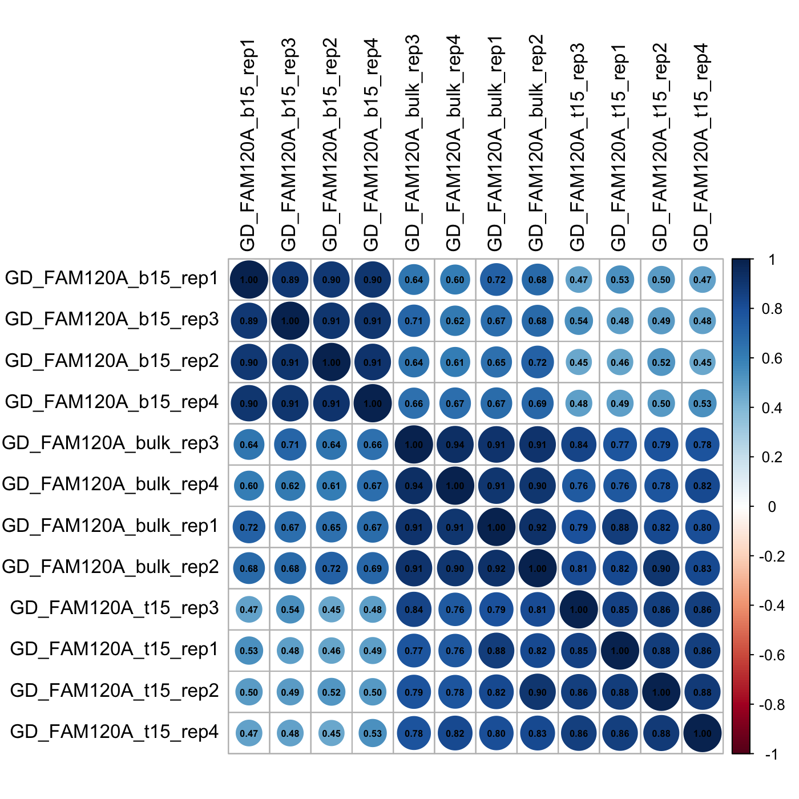
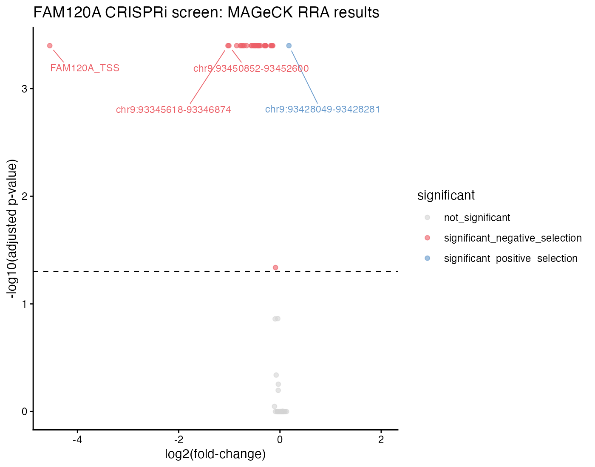
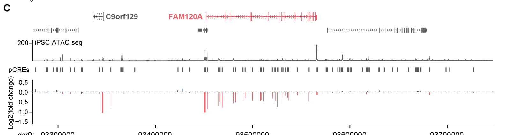

# CRISPRi HCR-FlowFISH Screen Analysis

Analysis pipeline for four CRISPRi HCR-FlowFISH screens, from demultiplexed FASTQs through regulatory element identification.

## Background

Common noncoding variants identified by GWAS map to noncoding regions of the genome where we don't know how they impact gene expression or which genes they regulate. CRISPRi HCR-FlowFISH screening addresses this: starting from a list of candidate, or putative, regulatory elements (pREs) identified from ATAC-seq peaks near a gene of interest, each pRE is targeted by a pool of gRNAs, cells are stained for the target transcript by hybridization chain reaction (HCR), and cells are sorted by FACS into bins based on target gene expression. Comparing gRNA abundance between the low- and high-expression bins identifies which of these candidate pREs, when repressed, significantly change expression of the target gene &mdash; directly identifying which regulatory elements control that gene.



This repository analyzes four such screens, three loci in i3N-WTC11 iPSCs and one in iNeurons:

| Screen | Cell type | Sample naming (this repo's convention) |
|---|---|---|
| FAM120A | i3N-WTC11 iPSC | `GD_FAM120A_{b15,t15,bulk}_rep{1-4}` |
| STAG1 | i3N-WTC11 iPSC | `GD_STAG1_{b15,t15,bulk}_rep{1-4}` |
| SV2A | i3N-WTC11 iPSC | `GD_SV2A_{b15,t15,bulk}_rep{1-4}` |
| SV2A | iNeuron (day 7) | `NGN2_SV2A_{b15,t15,bulk}_rep{1-4}` |

`b15`/`t15` are the bottom 15% / top 15% HCR-FlowFISH sorted bins (by target gene expression, normalized to housekeeping gene TBP); `bulk` is unsorted. Each locus's gRNA library targets pREs identified from ATAC-seq peaks across that locus, plus non-targeting controls.

### How the screen works

Cells expressing dCas9<sup>KRAB</sup> (iPSCs or iNeurons) are transduced with the pooled lentiviral gRNA library at a low multiplicity of infection, so that each cell receives at most one gRNA, then selected with puromycin so that only transduced cells remain. Each surviving cell now stably represses one pRE (or, for non-targeting controls, no element) via CRISPRi. Cells are then fixed, permeabilized, and stained by HCR-FlowFISH for both the target gene transcript and the housekeeping gene TBP (to normalize for cell size/permeability), and sorted by FACS into bins based on target gene expression &mdash; bottom 15% and top 15% in these screens &mdash; along with a bulk (unsorted) sample.

Genomic DNA is then extracted from each sorted bin as well as from a bulk (unsorted) sample of the same cells, and the gRNA sequence integrated into each cell's genome is PCR-amplified directly out of that genomic DNA and sequenced &mdash; that sequencing is the FASTQ data this pipeline processes. Since each cell carries one gRNA, sequencing and counting gRNAs in each bin measures how enriched or depleted each gRNA is between the low- and high-expression bins: a gRNA (and therefore its target pRE) enriched in the low-expression bin indicates that repressing that element decreases target gene expression, and vice versa.

The bulk sample serves as a reference for library representation rather than an expression comparison. If a gRNA is absent or poorly represented in the bottom/top bins but well represented in bulk, that's a real sorting effect. But if it's also poorly represented in bulk, it likely dropped out of the library for a technical reason unrelated to gene expression &mdash; it may not have PCR-amplified well, or cells carrying it may have had a growth defect and been lost over the several days the cells were in culture before sorting. Filtering on bulk read count (Step 6 below) removes these dropouts before they can be mistaken for a genuine expression effect.

Aggregating the enrichment signal across the gRNAs tiling each pRE and testing for significant enrichment (Steps 5-8 below) is how the screen identifies which candidate regulatory elements actively regulate the nearby gene.

## Tools and versions used

- Bowtie2 2.5.4
- samtools 1.21
- FASTX Toolkit 0.0.14 (fastx_trimmer)
- MAGeCK 0.5.9.4
- Python 3 with pandas
- R with dplyr, data.table, ggplot2, ggrepel, corrplot

## Repository contents

- `scripts/demultiplex.py` — demultiplexes a raw Read 1 FASTQ by matching a primer sequence at the beginning of each read and stripping it off. Edit the `READ_1_FILE` variable at the top of the script to point at your input FASTQ, then run:
  ```
  python demultiplex.py <primer_sequence> <output_sample_name>
  ```
  See the comments at the bottom of the script for the actual barcodes/indices used for the FAM120A screen as a worked example.
- `gRNA_libraries/` — Bowtie2 reference FASTAs for each locus (`FAM120A_gRNA_lib.fasta`, `STAG1_gRNA_lib.fasta`, `SV2A_gRNA_lib.fasta`; the same SV2A library is used for both the iPSC and iNeuron screens) and the shared non-targeting control guide list (`control_gRNAs.txt`, used identically across all four screens).
- `scripts/01_build_bowtie2_index.sh` through `scripts/07_analyze_mageck_results.R` — the full alignment/counting/QC/MAGeCK/results pipeline, walked through below using the FAM120A screen as a worked example. Plots are generated from the real FAM120A screen data; the underlying count tables and MAGeCK output are not included in this repo.

## Pipeline walkthrough: FAM120A

### 1. Demultiplex raw reads

Demultiplex each raw Read 1 FASTQ by sample using `scripts/demultiplex.py` (see above), matching each sample's primer/index sequence.

### 2. Build a Bowtie2 index for the locus

```
scripts/01_build_bowtie2_index.sh gRNA_libraries/FAM120A_gRNA_lib.fasta FAM120A_index
```

### 3. Trim demultiplexed reads to the protospacer window

Each sample's inline barcode is a different length (3-9 nt), so the trim window differs by sample:

```
scripts/02_trim_reads.sh <barcode_length> <sample>_read1.fastq <sample>_read1_trimmed.fastq
```

### 4. Align and generate per-guide counts

```
scripts/03_align_and_count.sh FAM120A_index <sample>_read1_trimmed.fastq <sample>
```

Produces `<sample>.counts` (guide name, read count).

### 5. Merge into a raw count table

```
python scripts/04_merge_counts.py GD_FAM120A_raw_counts.csv \
  GD_FAM120A_b15_rep1=GD_FAM120A_b15_rep1.counts \
  GD_FAM120A_t15_rep1=GD_FAM120A_t15_rep1.counts \
  GD_FAM120A_bulk_rep1=GD_FAM120A_bulk_rep1.counts \
  ... (remaining samples/replicates)
```

### 6. QC and RPM-normalize

```
Rscript scripts/05_qc_and_normalize_counts.R GD_FAM120A_raw_counts.csv GD_FAM120A_RPM.csv \
  GD_FAM120A_bulk_rep1 correlation.png diversity.png
```

Run once per replicate (using that replicate's bulk column), then combine the RPM-normalized replicate tables into a single count table for MAGeCK. This step produces two QC plots:

**Library representation in the bulk sample**, before filtering, with the minimum-count threshold marked:



Most guides are well represented (hundreds to low thousands of reads), well clear of the 10-read threshold; a small number of guides near zero reads are dropped by the filter so a handful of missing or barely-detected guides don't distort downstream normalization or MAGeCK's statistics.

**Replicate concordance**, checked via a sample-sample correlation matrix:



Sorted-bin and bulk samples cluster together as expected, and replicates of the same bin type are highly correlated with each other &mdash; a strong correlation in gRNA counts across replicates indicates high reproducibility, confirming the replicates are behaving consistently before they're combined and handed to MAGeCK.

### 7. Run MAGeCK RRA

```
scripts/06_run_mageck.sh GD_FAM120A_RPM.csv GD_FAM120A \
  GD_FAM120A_b15_rep1,GD_FAM120A_b15_rep2,GD_FAM120A_b15_rep3,GD_FAM120A_b15_rep4 \
  GD_FAM120A_t15_rep1,GD_FAM120A_t15_rep2,GD_FAM120A_t15_rep3,GD_FAM120A_t15_rep4 \
  gRNA_libraries/control_gRNAs.txt
```

CRISPR-Cas9 screening analysis is performed using MAGeCK RRA paired analysis comparing bottom (treatment) and top (control) sorted bins, using non-targeting gRNAs as controls. MAGeCK RRA outputs `<output_prefix>.gene_summary.txt` (per-element negative/positive selection scores, p-values, FDRs, and ranks) and `<output_prefix>.sgrna_summary.txt` (per-guide statistics).

### 8. Analyze MAGeCK results

```
Rscript scripts/07_analyze_mageck_results.R GD_FAM120A.gene_summary.txt GD_FAM120A_results.csv
```

Calls significant elements (Bonferroni-adjusted p-value <= 0.05, dashed line) from `gene_summary.txt` and plots them by log2(fold-change) vs. significance. Fold-change is signed so that negative values indicate repression decreases expression (elements enriched in the bottom sorted bin) and positive values indicate repression increases expression (elements enriched in the top bin):



The target gene's own promoter (`FAM120A_TSS`) is the clear top hit and falls on the negative side, consistent with CRISPRi at the promoter being expected to strongly decrease that gene's own expression &mdash; a useful positive control when interpreting a new screen's results.

## What the results show

Applying this pipeline across all four screens identifies regulatory elements that significantly modulate expression of the target gene, most of which decrease expression when repressed (consistent with disrupting an activating regulatory element) and a smaller number of which increase it:



For the FAM120A locus, pREs are distributed across the ATAC-seq-accessible regions spanning the expanded GWA locus, and multiple distal elements &mdash; not just the promoter &mdash; significantly decrease FAM120A expression when repressed (red bars), demonstrating that noncoding regulatory elements outside the promoter itself contribute to control of this gene's expression.
